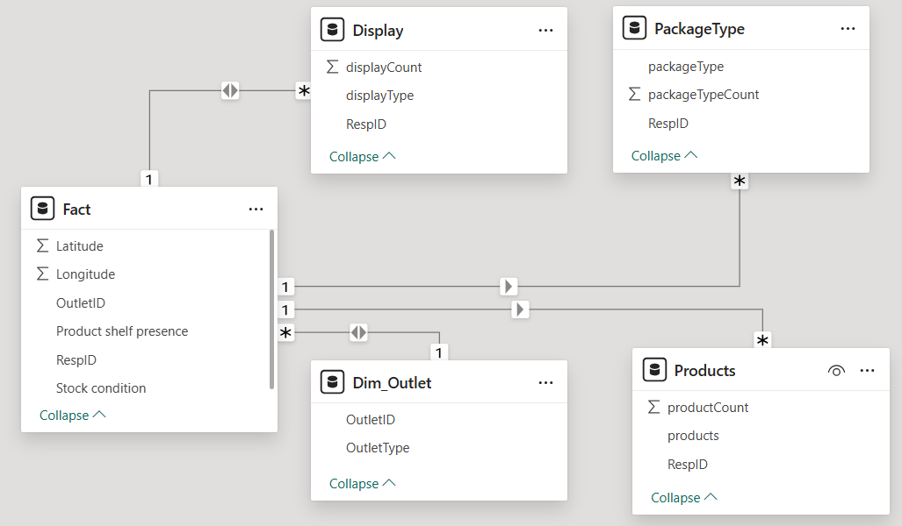
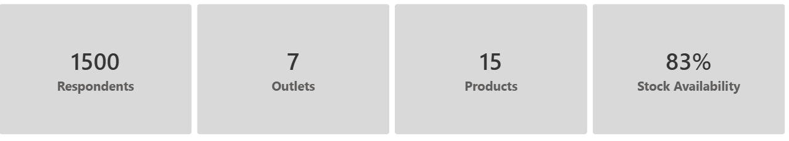
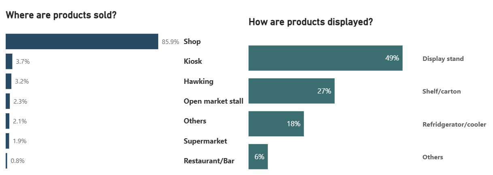
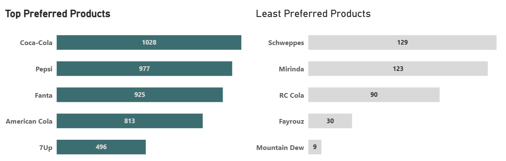
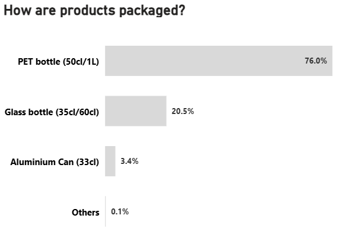
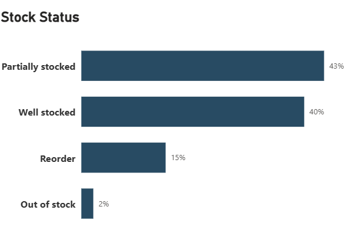
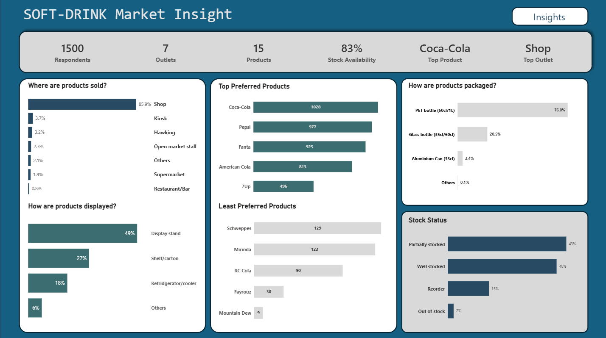

## Project Objective
The primary goal of this analysis is to uncover meaningful insights about the **soft drink market in Alimosho Local Government Area, Lagos**. This involves understanding **product distribution, brand presence, consumer preferences, and retail dynamics on the ground**. By analyzing outlet types, product packaging, shelf presence, and stock conditions, the analysis aims to answer critical business questions that can help brands, retailers, and distributors make data-driven decisions.

The focus is not merely on summarizing the data but telling a story that explains market realities—where products are available, which brands dominate, how packaging influences visibility, and which retail formats are most effective for product display.

## Data structure
The data included a flat table file of the survey response, which was cleaned with power query and transformed to a dimensional table format

## Analysis Result
 
From the 1500 survey responses collected across **7 outlet types**, the market shows a diverse retail environment but dominated by traditional informal outlets. With **15 unique products** captured, consumer choice appears broad, yet the distribution patterns suggest that only a handful have strong visibility. A few dominant brands command the majority of visibility, while several others trail significantly behind. This immediately signals a highly competitive but uneven market, where only a small cluster of brands have achieved widespread penetration across outlets.

The overall **83% stock availability** indicates a generally healthy supply chain and supplier efficiency, but the remaining gap suggests room for improvement in replenishment efficiency and consistency across certain outlets.

**Where products are sold:**
The distribution landscape is overwhelmingly driven by **small neighborhood shops**, which account for **85.9%** of all product sightings. Other outlet types including kiosks, hawkers, open market stalls, supermarkets, and restaurants collectively contribute a much smaller share. This makes it clear that most soft drink consumption points are rooted in informal, street-level retail rather than formal commercial spaces.

**How products are displayed:**
Product visibility is largely shaped by **display stands (49%) and shelf/carton placements (27%)**, meaning most soft drinks are displayed openly and are easily accessible to customers. Only **18% of products** are found in **refrigerators or coolers**, indicating limited cold-drink availability. This highlights an opportunity for brands to invest in refrigeration to improve consumption appeal, especially in a climate where cold beverages are preferred.

Together, the charts show that Alimosho’s soft drink market is visibility-driven, informal, and dependent on simple display structures, providing clear direction for merchandising and distribution strategy.

The strongest-performing products are overwhelmingly established mainstream soft drink brands.
**Coca-Cola leads** with 1,028 sightings, making it the most widely visible and stocked product in the market. **Pepsi (977) and Fanta (925)** follow closely, reinforcing their strong distribution networks. This three accounts for 16.3%, 15.5% and 14.7% respectively of total product quantity.
American Cola (813) shows notable presence despite being a non-traditional brand, suggesting aggressive retail penetration. 7Up (496) rounds out the top five.
This pattern shows a clear dominance of cola-based and mainstream carbonated drinks, reflecting strong distribution and consistent brand loyalty in Alimosho.

At the lower end of visibility: **Schweppes (129) and Mirinda (123)** have modest presence, likely due to niche demand or limited placement in smaller outlets. **RC Cola (90) and Fayrouz (30)** appear infrequently, signaling weak retail penetration. **Mountain Dew (9)** has the lowest visibility, showing extremely limited market reach.
The least 5 **(collectively <10%)** consists largely of specialty drinks, mixers, or secondary cola brands which struggle in an environment dominated by high-turnover mainstream soft drinks. This Low visibility may reflect limited distribution agreements, lower demand, or a strategic focus on specific outlet types that are underrepresented in the sample.

The packaging landscape is clearly dominated by **PET bottles, which account for 76%**  of all soft drink packaging formats observed. This dominance reflects the practicality, affordability, and widespread acceptance of PET bottles across informal retail environments such as small shops, kiosks, and open market stalls—which make up the bulk of outlets in Alimosho. PET bottles also align well with consumer preferences for resealable, portable containers suited to on-the-go consumption.

**Glass bottles represent 20.5%** of packaging, indicating a strong presence but one likely concentrated in outlets where bottle return systems are common, such as neighborhood shops and restaurants. Their share suggests that refillable glass formats are still relevant, especially for legacy brands with established return logistics.

**Aluminium cans contribute only 3.4%**, showing minimal penetration. This is typical in markets dominated by informal retail, where can displays are limited and refrigeration capacity is low. **Cans rely heavily on cold-chain availability** which the earlier charts show is only 18%, helping explain their modest presence.
The “Others” category at 0.1% confirms that alternative packaging formats are nearly nonexistent in this market.

### Dashboard View

[power bi dashboard](https://app.powerbi.com/view?r=eyJrIjoiOTY1M2U1MDktZWM5ZC00ZjI1LTlkZmQtMDk3ZGEyYzI1NjZlIiwidCI6IjczMDc4ZWNkLWYzM2UtNDQxYy05ODYyLWVhZDdjNjFhNGU4MiJ9)

## Recommendations
